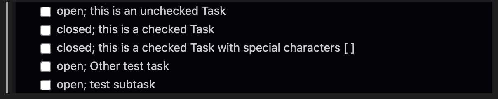

# Markdown Data-Views for Visual Studio Code

Data-driven Markdown views for note-taking and more.
Query information in your markdown documents and inject the result dynamically.


## Features

This extension uses the [Markdown Query Language](https://github.com/MDQL/mdql) to enable dynamic data views within markdown documents.

Example:

This code block in any markdown document

    ```mdql
    TASKLIST status,text FROM tasks
    ```

will render as



You can also inject the result directly into your markdown document to store the returned data within your git repository.

## Requirements
Recommended Extensions are:
- [Markdown all in one](https://marketplace.visualstudio.com/items?itemName=yzhang.markdown-all-in-one)

